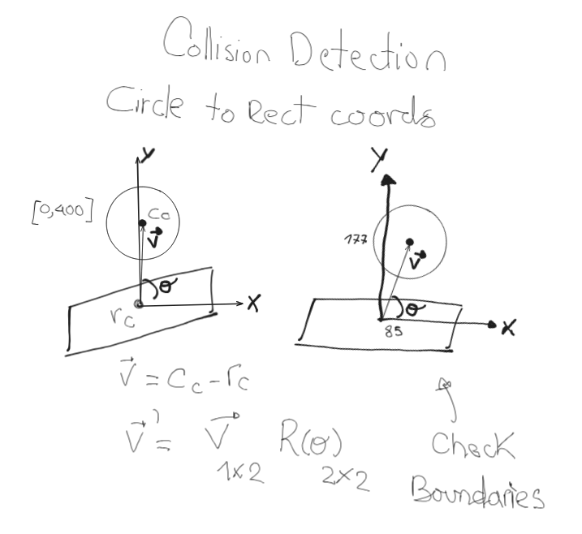
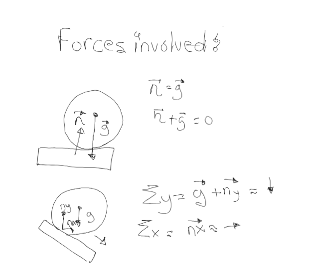
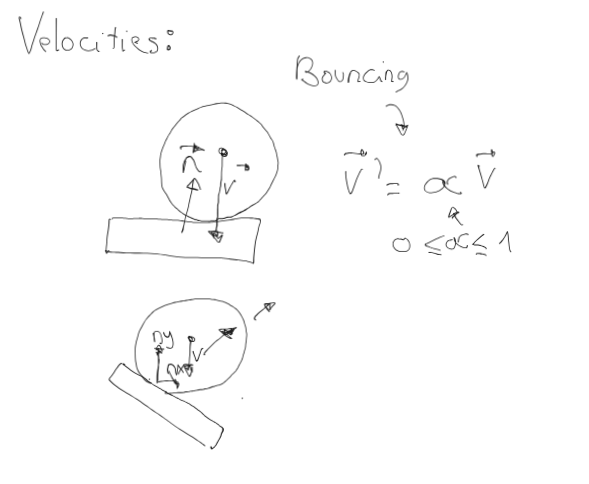
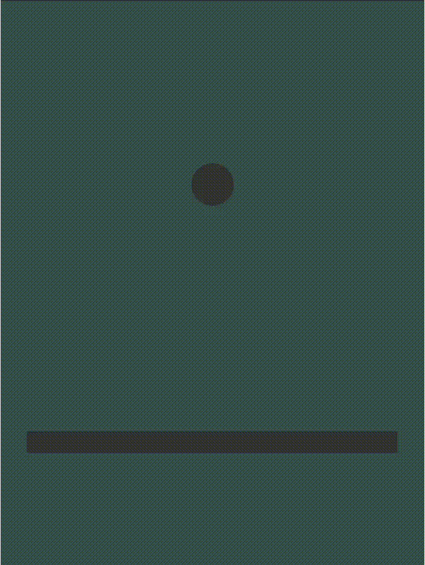

# Bouncing Ball Basic Simulation

This simulation demonstrates the behavior of a bouncing ball, created for learning purposes. The goal was to explore and practice concepts related to physics and the rendering process using OpenGL.

## Collision Logic

The collision detection system works by transforming the circle's center into the rectangle's coordinate system using a rotation matrix. Once the circle is aligned with the rectangle's coordinates, we can check the boundaries to determine if the objects collide.

### Key Concepts:
- **Rotation Matrix**: Used to align the circle with the rectangle for collision detection.
- **Boundary Check**: Determines if the objects overlap based on their positions.

## Force Analysis

This analysis addresses the situation where the ball is stationary at a point on the ground. In this case, gravity acts upon the ball and moves it along the surface, which may be rotated.

### Key Concepts:
- **Gravity**: A force that influences the ball’s movement when it is at rest on the surface.
- **Surface Interaction**: The effect of the rotated surface on the ball’s movement under gravity.

## Bouncing Analysis

This analysis focuses on how the ball bounces after a collision. After impact, the ball's velocity is recalculated, ensuring it aligns with the surface's normal vector, considering energy loss during the collision.

### Key Concepts:
- **Elastic Collision**: The ball retains some of its velocity based on the coefficient of restitution (COR).
- **Normal Vector**: The direction in which the ball will bounce is determined by the surface’s normal.

## Demo

Here is a video showcasing the results of the simulation. Watch the ball bounce off the surface, demonstrating realistic motion and collision behavior.

## Conclusion

This project helped in understanding basic physics principles like gravity, collisions, and forces, while also providing a hands-on approach to implementing these concepts with OpenGL. The bouncing ball simulation is a great starting point for learning more about physics simulations and 2D rendering techniques.

